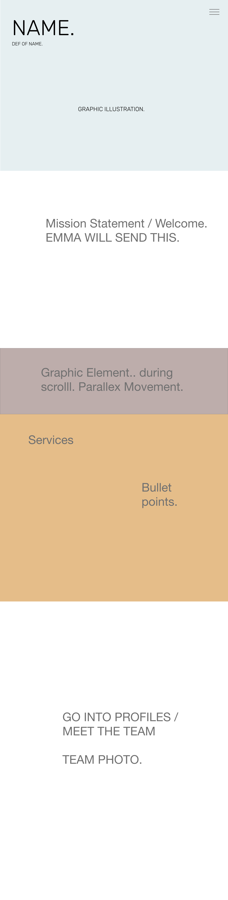
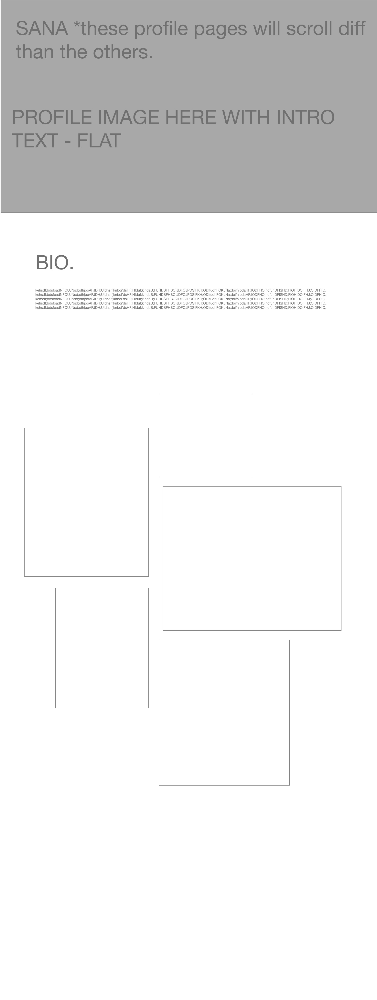
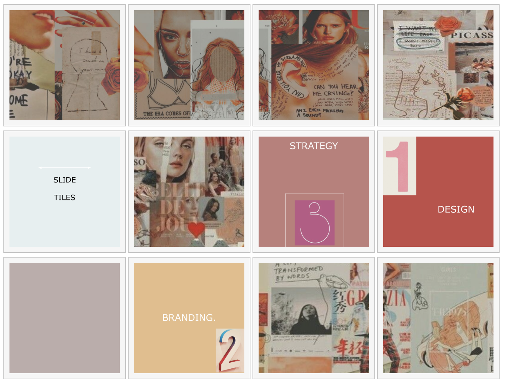

# Designare Website Documentation
##A Project for Web and Mobile
###OCAD University, Masters in Digital Futures Spring 2018

###Introduction
Hello, and welcome to our website for a proposed content creation/design and branding company called Designare. Our website incorporates HTML5, CSS, JQuery, Javascript, and SVG.

Our design process initially started with a brainstorming session for figuring out:
1. Our overall style/things we wanted to highlight as a “company”
2. The name
3. The color palette
4. Roles
5. The vibe of our brand (list: award winning, youthful, community, experience, service, fresh)

#Design process
We decided on [this color palette](http://colorpalettes.net/color-palette-3501/ "Color palette").

##Home page

##Profile page

##Home page, round 2

#Continuing website strategy
Once we figured out what our company represented we searched for some websites to gain some ‘big’ inspiration, such as [this one](https://www.grandimage.com "Grand image").

[This](https://codepen.io/ramenhog/pen/MpORPa) is the original code for the gallery.

This is an example of an image from a website we liked for the theme and role of ours:

We wanted to add in some ‘fun’ elements because our brand represents youthful. And this is shown by including a puzzle game!

Some of the tools we looked at using were SASS, WEBGL, D3, and THREE.JS however, with time we decided to keep it simple and focus on the languages we are both new to, but more comfortable with. So we could source code and learn without going too big and having nothing to show.

As a side note, we also took time to work on our page and make it realistic by doing a photoshoot and taking cover shots which we used in our personal profile pages. To show that we are a true brand.

###Things learned:
Github Desktop. This was a learning curve because we found the ‘pulling’ and ‘fetching’ was not as smooth we assumed it to be. We started our website using this - however it kept deleting code and creating more errors, so we decided to put it on hold and have each of us working on code (we used Codepen and Atom) and send it to Sana to upload into Github.

Another thing we learnt: Some of the code, like the Portfolio Gallery we coded, we chose code that was a little above and beyond our understanding, But it was a fun experiment for us to learn. Savaya worked on building the framework, Emma worked on updating the hover code, and Sana worked on fine tuning it to fit into our website theme and adjust the errors. 

For the portfolio images hover code, we changed the hover colour as well as removing the bottom description box. We also had to create a item_details:after [function] in order to make the text appear with the hover, rather than it being constant, which is what happened by removing the lower box. The item_details opacity were set to 0 while with the hover it became 1. This gave us the desired effect but we still experienced glitches. The text didnt always appear because of different sizes of the image div and item div. Additionally, the text over top of the images in the profiles were coded in rather than a part of the image.

We found that using Codepen and then Atom/Brackets was too much. Things were not translating as smoothly and easily between Codepen and Atom, and then uploading it back into Github Desktop. 